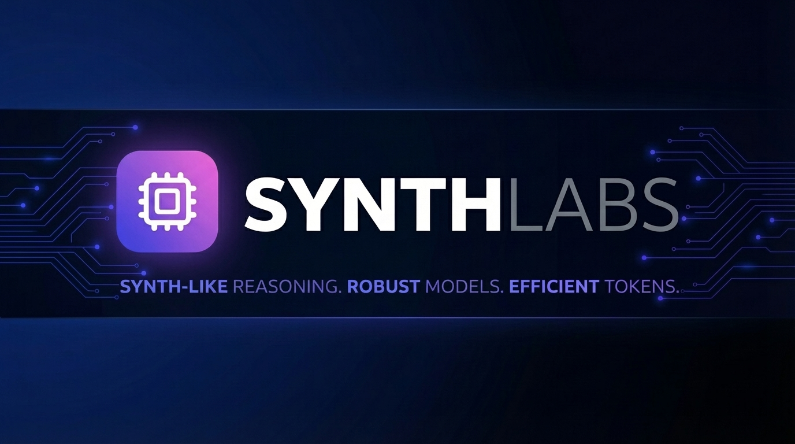

<div align="center">


# SynthLabs Reasoning Generator

**Create high-quality synthetic reasoning datasets for training AI models**

[](https://nodejs.org/)
[](https://www.typescriptlang.org/)
[](https://firebase.google.com/)

</div>

---

## Features

### Generator Mode
Create synthetic datasets from scratch using AI-powered generation. Define topics, customize prompts, and generate high-quality reasoning traces in the [SYNTH](https://huggingface.co/datasets/PleIAs/SYNTH) format.

Core idea: [SYNTH The New Data Frontier by PleIAs](https://pleias.fr/blog/blogsynth-the-new-data-frontier)

<details>
<summary>📸 Screenshot</summary>


</details>

---

### Converter Mode
Transform existing datasets into reasoning-enhanced formats. Full **HuggingFace** integration lets you search, preview, and convert public datasets with automatic reasoning trace generation.

---

### DEEP Mode
Multiple AI agents working together in sophisticated pipelines:
- **Meta Agent**: Analyzes and plans approach
- **Retrieval Agent**: Gathers relevant information
- **Derivation Agent**: Builds logical chains
- **Writer Agent**: Composes the response
- **Rewriter Agent**: Polishes and refines

---

### Multi-turn Support
Go beyond single Q&A pairs:
- Generate multi-turn conversations
- Let the model ask follow-up questions
- Choose responders using SYNTH-style thinking
- Perfect for dialogue and instruction-following datasets

---

### Data Preview

Have data but unsure what's inside? Explore it directly with our HuggingFace-style table viewer:
- Column type detection (string, number, array, object)
- Search and filter capabilities
- Fullscreen expansion with pagination
- Click any row to see full details

<details>
<summary>📸 Screenshots</summary>


</details>

---

### Verifier View

Quality control your generated data:
- Review and evaluate entries
- Remove duplicates automatically
- Assign ratings (1-5 stars)
- Export only verified, high-quality data

<details>
<summary>📸 Screenshots</summary>


</details>

---

### Cloud Integration

Seamless Firebase/Firestore support:
- **Development Mode**: Download data directly as JSONL files
- **Production Mode**: Upload to your Firestore database with one click
- Session management and persistence
- Real-time sync across devices

<details>
<summary>📸 Screenshot</summary>


</details>

---

### Additional Features

| Feature | Description |
|---------|-------------|
| **Multiple Providers** | Support for Gemini, OpenAI, Anthropic, and custom endpoints |
| **Concurrent Workers** | Parallel processing for faster generation |
| **Smart Retry** | Automatic retry with exponential backoff |
| **Session Management** | Save, load, and manage multiple generation sessions |
| **Export Formats** | JSONL, JSON, and Parquet support |
| **HuggingFace Upload** | Push directly to HuggingFace Hub |

---

## Quick Start

### Prerequisites
- Node.js 18+
- API keys for your preferred provider(s)

### Installation

1. **Clone and install dependencies:**
   ```bash
   git clone <repository-url>
   cd synthlabs-reasoning-generator
   npm install
   ```

2. **Configure API keys:**
   
   Copy `.env.example` to `.env.local` and add your keys:
   ```bash
   cp .env.example .env.local
   ```
   
   Edit `.env.local` with your API keys:
   ```env
   VITE_GEMINI_API_KEY=your-gemini-key
   VITE_OPENAI_API_KEY=your-openai-key
   VITE_ANTHROPIC_API_KEY=your-anthropic-key
   # Add other provider keys as needed
   ```

3. **Run the app:**
   ```bash
   npm run dev
   ```

4. **Open in browser:**
   Navigate to `http://localhost:3000`

---

## Custom Prompts

The generator supports dynamic prompt sets. You can create your own "persona" or logical framework by adding files to the `prompts/` directory.

### Create a New Prompt Set

1. Create a new folder in `prompts/` (e.g., `prompts/my-set/`).
2. Inside your set folder, create subdirectories for each category:
   - `generator/`
   - `converter/`
   - `verifier/`
3. Add `.txt` files for each role. The app will automatically discover your set and show it in the **Settings > Prompts** tab.

### Directory Structure & Roles

```text
prompts/
  └── <set_name>/
      ├── generator/
      │   ├── system.txt      (Main generator persona)
      │   ├── meta.txt        (Task decomposition)
      │   ├── retrieval.txt   (Constraint identification)
      │   ├── derivation.txt  (Logical reasoning chains)
      │   ├── responder.txt   (Final answer formulation)
      │   └── user_agent.txt  (Multi-turn interaction agent)
      ├── converter/
      │   ├── system.txt      (Main converter persona)
      │   ├── writer.txt      (Writing the final reasoning trace)
      │   └── rewriter.txt    (Polishing converted output)
      └── verifier/
          ├── query_rewrite.txt
          ├── reasoning_rewrite.txt
          ├── answer_rewrite.txt
          └── message_rewrite.txt
```

> [!TIP]
> If a specific role file is missing in your custom set, the system will automatically fall back to the version in the `default` set.

---

## Firebase Setup (Optional)

For cloud persistence and production mode, set up Firestore:

1. Create a Firebase project at [console.firebase.google.com](https://console.firebase.google.com)

2. Enable Firestore Database

3. Add these Security Rules (Firestore Database → Rules):

```javascript
rules_version = '2';
service cloud.firestore {
  match /databases/{database}/documents {
    match /synth_logs/{document=**} {
      allow read, write: if true; # change if needed (too open for production)
    }
    match /synth_sessions/{document=**} {
      allow read, write: if true;  # change if needed (too open for production)
    }
  }
}
```

4. Configure your Firebase credentials in the app's settings panel

---

## Output Format

Generated data follows the SYNTH format:

```json
{
  "query": "What is the capital of France?",
  "reasoning": "<think>The user is asking about geography...</think>",
  "answer": "The capital of France is Paris.",
  "messages": [...],
  "isMultiTurn": false,
  "metadata": {
    "provider": "gemini",
    "model": "gemini-2.0-flash",
    "timestamp": 1704067200000
  }
}
```

---

## Contributing

Contributions are welcome! Please feel free to submit issues and pull requests.

---

## License

This project is licensed under the Apache 2.0 License.

---

## Citation

If you find this tool useful, please cite it as:

```
@misc{synthlabs,
    author = {Kurman, Mariusz},
    title = {SYNTHLabs Reasoning Generator},
    howpublished = {\url{https://github.com/mkurman/synthlabs}},
    year = {2026}
}
```

Thank you!

---

<div align="center">

**Built with ❤️ for the AI research community**

</div>
